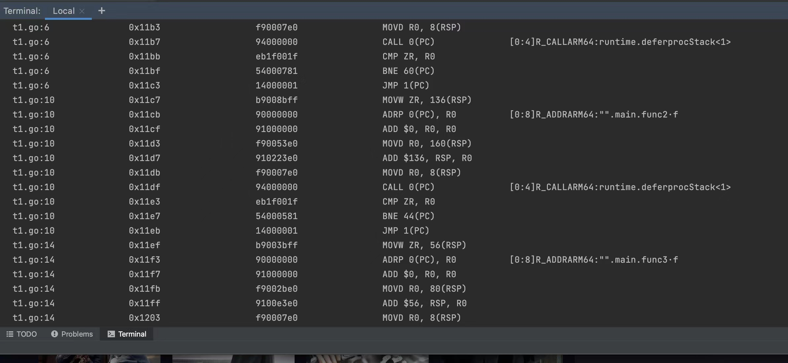

编译不内连
```shell script
go tool compile -N -l t3.go  
```
查看汇编
```shell script
go tool objdump t3.o 
```

查看编译信息
```shell script
go build -gcflags '-m -l'  t3.go  
```

请注意不通的cpu架构的汇编会略有不同，如下为m1芯片



defer未逃逸的情况下是走的
runtime.deferprocStack


defer逃逸情况下
runtime.deferproc
