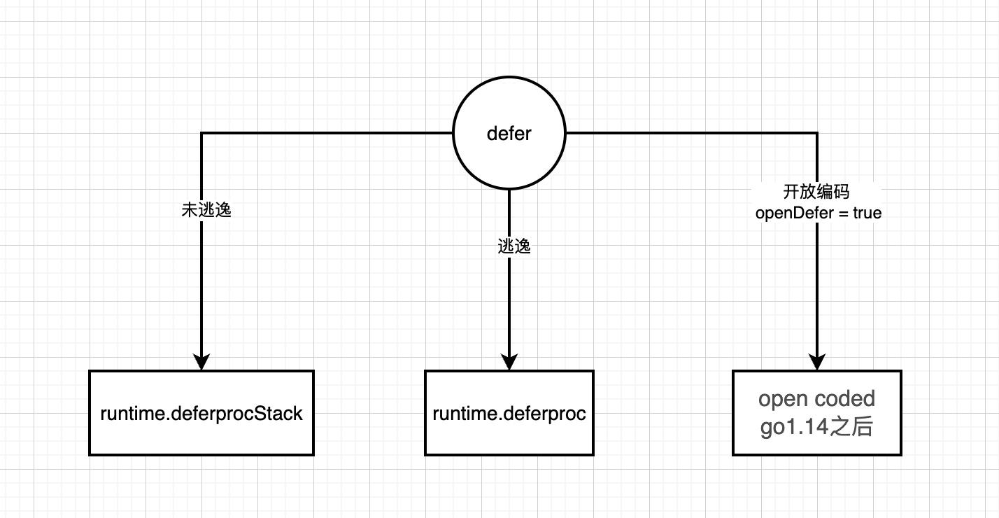

编译不内连
```shell script
go tool compile -N -l t3.go  
```
查看汇编
```shell script
go tool objdump t3.o 
```

查看编译信息
```shell script
go build -gcflags '-m -l'  t3.go  
```

请注意不通的cpu架构的汇编会略有不同，如下为m1芯片


defer未逃逸的情况下是走的
runtime.deferprocStack


defer逃逸情况下
runtime.deferproc



Go 1.14 版本继续加入了开发编码（open coded），该机制会将延迟调用直接插入函数返回之前，省去了运行时的 deferproc 或 deferprocStack 操作，在运行时的 deferreturn 也不会进行尾递归调用，而是直接在一个循环中遍历所有延迟函数执行。
这种机制使得 defer 的开销几乎可以忽略，唯一的运行时成本就是存储参与延迟调用的相关信息，不过使用此机制需要一些条件：
没有禁用编译器优化，即没有设置 -gcflags "-N"；
函数内 defer 的数量不超过 8 个，且返回语句与延迟语句个数的乘积不超过 15；
defer 不是在循环语句中。 该机制还引入了一种元素, 延迟比特（defer bit），用于运行时记录每个 defer 是否被执行（尤其是在条件判断分支中的 defer），从而便于判断最后的延迟调用该执行哪些函数。

```go
type _defer struct {
   siz     int32     //所有传入参数的总大小
   started bool      //该defer是否已经执行过
   heap    bool      //该defer是否存储在heap上
   openDefer bool    //开放编码
   sp      uintptr   //SP函数栈指针寄存器，一般指向当前函数栈的栈顶
   pc      uintptr   //程序计数器。线程利用它来跟踪下一个要执行的指令.
   fn      *funcval  //指向传入的函数地址和参数
   _panic  *_panic   //指向_panic链表
   link    *_defer   //指向_defer链表

    fd   unsafe.Pointer // 与框架关联的函数的funcdata
	varp uintptr        // 堆栈的varp值
	
	// framepc is the current pc associated with the stack frame. Together,
    // with sp above (which is the sp associated with the stack frame),
    // framepc/sp can be used as pc/sp pair to continue a stack trace via
    // gentraceback().
    framepc uintptr     //framepc是与堆栈帧关联的当前pc
}

type funcval struct {
   fn uintptr
   // variable-size, fn-specific data here
}
```