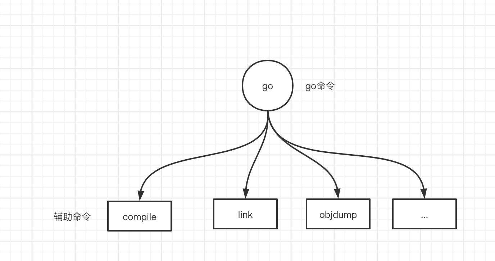
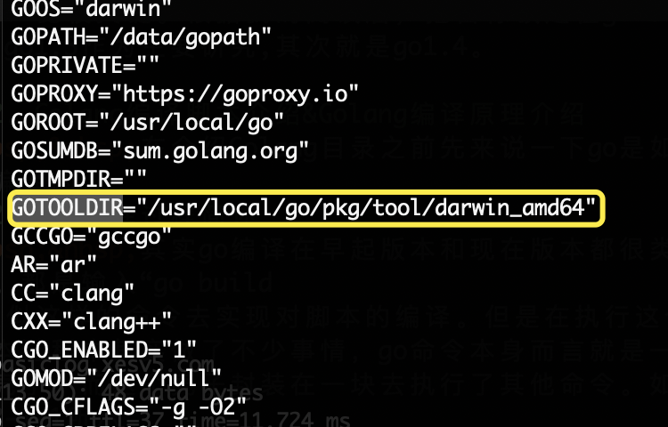
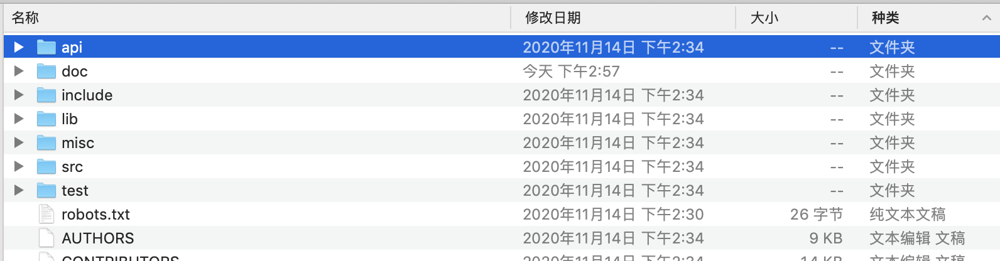
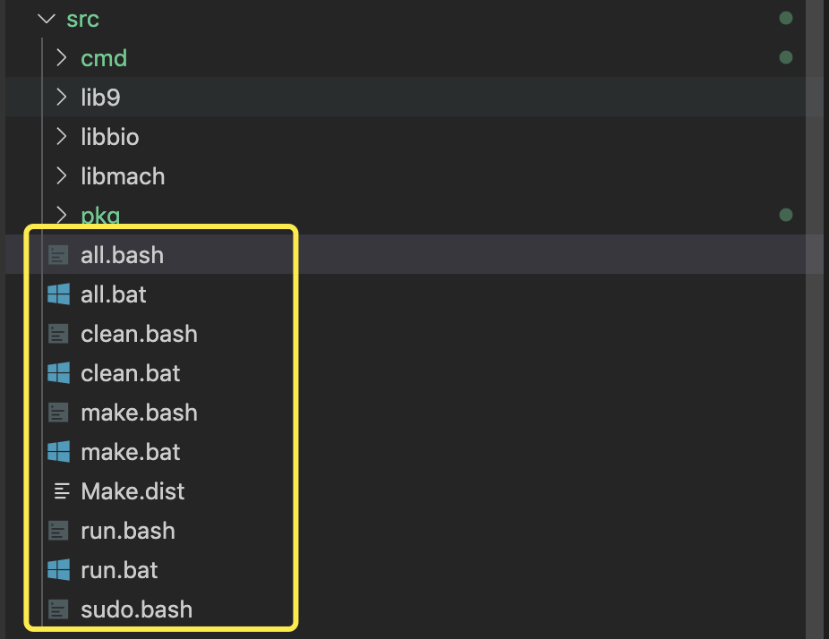
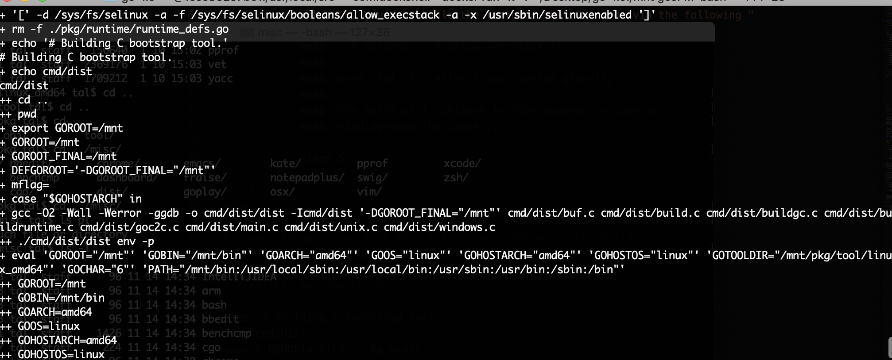
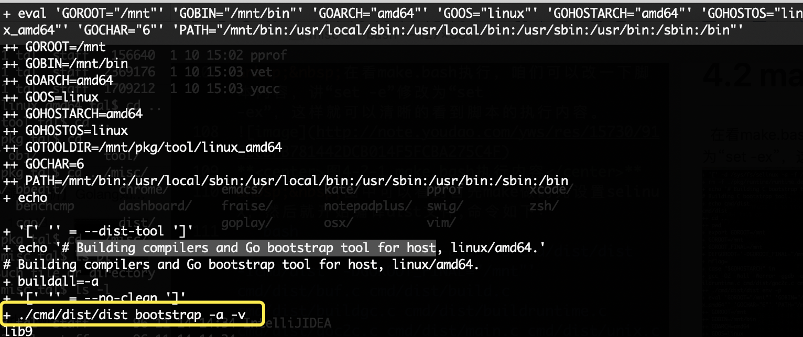

#【Golang源码分析】Golang如何实现自举（一）

# 前言
&nbsp;&nbsp;在写一篇文章之前，某位大佬勾起了我对学习这个主题的欲望。刚好那天带着病痛，后来根据一个Makefile字符集的问题，拿着开始研究。发现研究、研究不疼了，果然和周星驰电影《国产凌凌漆》一样精神麻醉才是最好的麻醉药。今年以来也没有给自己立啥学习目标，刚好研究Golang自举动，可以作为我今年的学习目标。该篇文章只是个开始，后续会继续迭代。

&nbsp;&nbsp;大家都知道在Go早起其实编译器并不是go去编写的，后期自举实现了编译。不过在学习Golang自举之前要了解一下Golang的版本发展历史。

Golang GitHub： https://github.com/golang/go

# 1. Golang版本历史&研究方向
&nbsp;&nbsp;在github对比golang的历史版本之后，发现其实go在的release发布版本中go1 ~ go1.4版本都还是处于C去实现编译器。然后在go1.5版本实现了自己的编译器。

&nbsp;&nbsp;如何按照这个历程，研究go自举的话，应该是从没改变前去发起研究。那么其实是研究go1 ～ go1.4比较关键。根据我的阅读后，把目标锁定在go1.2 ～ go1.3作为主要研究,其次就是go1.4。

# 2. Golang编译脚本介绍&Golang编译原理介绍
&nbsp;&nbsp;在介绍Golang目录之前先来说一下go是如何编译的。
# 2.1 go编译过程简述
&nbsp;&nbsp;其实go编译在早起版本和现在版本都很类似。都是输入“go build ”类似这样的命令去实现对脚本的编译。但是在执行这个脚本过程中其实做了不少事情，go命令本身而言就是一个壳子，而这个壳子封装在一块去执行了其他命令。如图2-1-1所示。

**<center>图2-1-1 go命令执行</center>**
&nbsp;&nbsp;然后这些命令呢,其实对应在go的环境变量GOTOOLDIR下，通过“go env”可以查看，如图2-1-2所示。

**<center>图2-1-2 Go环境变量</center>**
&nbsp;&nbsp;不同系统的go命令所在的目录并不一致，这里涉及到系统存在不同的PE结构。tool在的目录是根据系统版本命令，其次要学习go底层其实应该去调试compile，这样词法解析，语法解析都可以调试到。

&nbsp;&nbsp;不过编译的话不单单是这些，编译性语言会有很繁琐的编译步骤，首先编译会经过词法解析，语法解析，优化器，然后生成机器码。生成机器码后，还会经过连接器、buildid过程等等。

&nbsp;&nbsp;不过该主题的重点还不在这一块，对这一块有兴趣的可以去看看我之前的文章《【Golang源码分析】解析执行命令complie（二）词法解析》与《【Golang源码分析】深度解析执行命令（一）go build
》两篇文章。

# 2.2 go编译脚本介绍
&nbsp;&nbsp;经过2.1小节简单的洗礼，基本对go的编译过程有一个大致的了解。那么可以先了解下go1.3，看一下go1.3的结构是什么样的。

**<center>图2-2-1 目录结构</center>**
&nbsp;&nbsp;目录中分为api、doc、include、lib、src、misc、test七个原始目录，编译后还会生成bin、pkg两个目录。
- api目录：api目录为api Check，对应工具"go tool api"相应源码 src/cmd/api。
- doc目录：doc目录为文档，如果要编译，或者了解一些版本信息，可以看一下这个目录中html内容。
- include目录：依赖C头文件目录。
- lib目录：依赖库文件目录。
- src目录：源代码目录，其中编译文件就在该目录。
- misc目录：一些杂项脚本都在这里面。
- test目录：测试用力目录。
- bin目录：生成go、godoc、gofmt文件都在该目录。
- pkg目录：生成对应系统动态连接库，以及对应系统的工具命令都在该目录，如cgo、api、yacc等等。新版本中会有compile

# 3.编译Golang
&nbsp;&nbsp;在编译go1.3之前，来看一下对应go下doc的文档都说了一些啥。
<pre>
The simplest way to install gccgo is to install a GCC binary release built to include Go support. GCC binary releases are available from various websites and are typically included as part of GNU/Linux distributions. We expect that most people who build these binaries will include Go support.

The GCC 4.7.0 release includes Go support that is very close to Go 1. Due to release timing it will not include the last few changes to the Go 1 libraries. The GCC 4.7.1 release should include a complete Go 1 compiler and libraries.
</pre>
&nbsp;&nbsp;文档中说：
<pre>
安装gccgo的最简单方法是安装为包含Go支持而构建的GCC二进制发行版。GCC二进制发行版可从 各种网站获得，通常包含在GNU / Linux发行版中。我们期望大多数构建这些二进制文件的人将包括Go支持。

GCC 4.7.0版本包含与Go 1非常接近的Go支持 。由于发布时间的限制，它将不包括对Go 1库的最后几处更改。GCC 4.7.1版本应包含完整的Go 1编译器和库。
</pre>

# 3.1 安装gcc环境
&nbsp;&nbsp;根据上述提示，咱们可以考虑使用GCC 4.7.0或者GCC 4.7.1版本去编译go。这样兼容性会好一些。这里我使用的是gcc4.7,gcc安装过于麻烦，我直接使用docker镜像这样方便快捷。
```bash
拉取gcc4.7镜像
#docker pull gcc:4.7

执行把下载好的go1.3源码挂到docker的mnt目录中并执行进入终端
#docker run -it -v /Users/zhaoyu/Desktop/go:/mnt gcc:4.7 bash
```
&nbsp;&nbsp;在拉取镜像后，建议自己本地把docker执行的仅从“docker commit”一个本地镜像，方便下次使用。

## 3.2 编译
&nbsp;&nbsp;根据2.3小节内容概述，其实编译go比较简单，咱们如果是想全部编译的话，直接执行./all即可，命令如下：
```bash
#cd /mnt/src
#./all.bash
```

# 4.解读编译文件
&nbsp;&nbsp;了解完2、3小节中内容。基本知道如何编译go，那我们可以来解析下all.bash文件。

# 4.1 all.bash文件解读

**<center>图4-1-1 bash文件</center>**
&nbsp;&nbsp;其实all.bash文件只是针对*nix系统的系统执行的，这样linux和unix系统都可以执行。因为是bash脚本。然后windows系统的可以执行*.bat文件，如图4-1-1 所示。

&nbsp;&nbsp;编译脚本文件总共有all.*、clean.*、make.*、run.*四类。分为对应全部执行脚本、清理脚本、编译脚本、测试脚本。

&nbsp;&nbsp;那么来看一下all.bash脚本内容：
```bash
#!/usr/bin/env bash
# Copyright 2009 The Go Authors. All rights reserved.
# Use of this source code is governed by a BSD-style
# license that can be found in the LICENSE file.

set -e
if [ ! -f make.bash ]; then #判断是否有make脚本
	echo 'all.bash must be run from $GOROOT/src' 1>&2
	exit 1
fi
OLDPATH="$PATH"    #获得当前目录
. ./make.bash --no-banner  #执行编译
bash run.bash --no-rebuild #执行测试
PATH="$OLDPATH"
$GOTOOLDIR/dist banner   #打印编译内容
```
&nbsp;&nbsp;可以清晰的看到，编译内容主要是在make.sh脚本中。那么主要还是看make.bash脚本。

# 4.2 make.bash文件解读
&nbsp;&nbsp;在看make.bash执行，咱们可以改一下脚本内容，讲“set -e”修改为“set -ex”，这样就可以清晰的看到脚本的执行内容。

**<center>图4-2-1 make.bash执行内容</center>**
&nbsp;&nbsp;图中可以看到首先make做的先设置selinux，然后就开始编译dist文件,命令如下：
```bash
#gcc -O2 -Wall -Werror -ggdb -o cmd/dist/dist -Icmd/dist '-DGOROOT_FINAL="/mnt"' cmd/dist/buf.c cmd/dist/build.c cmd/dist/buildgc.c cmd/dist/buildruntime.c cmd/dist/goc2c.c cmd/dist/main.c cmd/dist/unix.c cmd/dist/windows.c
```

**<center>图4-2-2 编译go_bootstrap文件</center>**
&nbsp;&nbsp;编译好dist后，又开始编译go_bootstrap文件。
&nbsp;&nbsp;然后编译完成go_bootstrap后，又通过go_bootstrap编译了go文件，最终删除go_bootstrap。执行命令过程如下：
```bash
移动dist命令到工具包目录下
# mv cmd/dist/dist /mnt/pkg/tool/linux_amd64/dist

清理缓存文件
#/mnt/pkg/tool/linux_amd64/go_bootstrap clean -i std

编译go并安装到bin目录中
# /mnt/pkg/tool/linux_amd64/go_bootstrap install -gcflags '' -ldflags '' -v std

删除go_bootstrap文件
# rm -f /mnt/pkg/tool/linux_amd64/go_bootstrap
```
&nbsp;&nbsp;通过整个执行过程，可以看出go1.3其实是通过go_bootstrap编译出来了的。

&nbsp;&nbsp;那么后续主要研究内容就是dist和go_bootstrap。

# 总结
&nbsp;&nbsp;自举的内容比较杂也比较多，会有一个系列的文章去概述，先来总结下内容把。

1. go1 ～ go1.4 为c实现编译器。
2. go1 使用GCC 4.7.0活GCC 4.7.1最为佳。
3. go1编译文件在src目录中,对应make.bash脚本。
4. go命令只是一个命令的组装工具。
5. go1.3中go是通过go_bootstrap编译出来的，go_bootstrap又是通过dist编译出来的。

