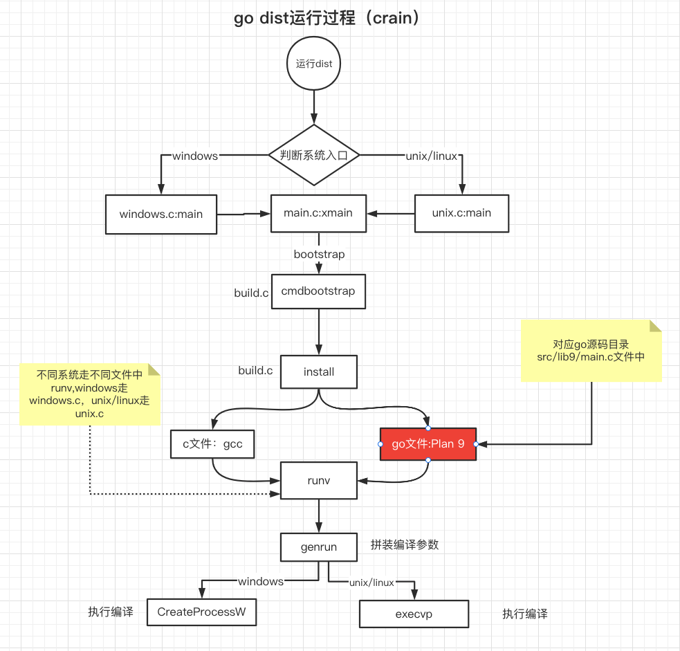
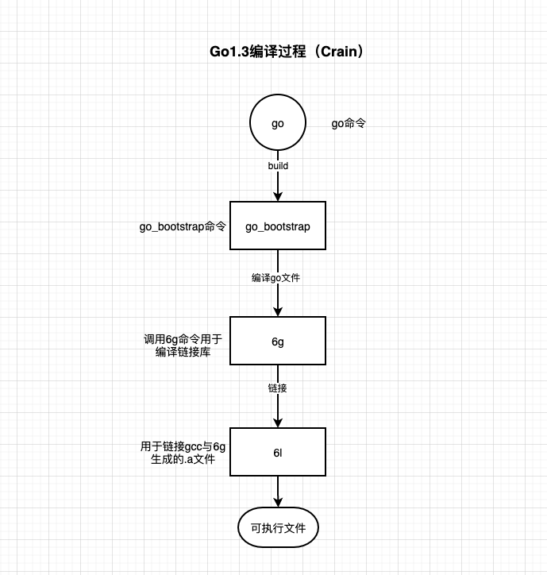
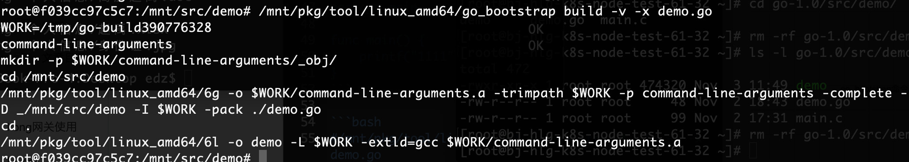
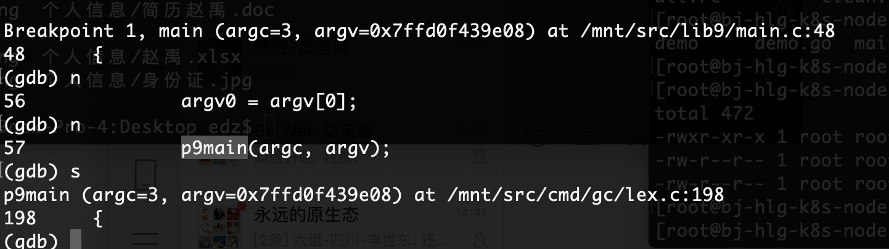
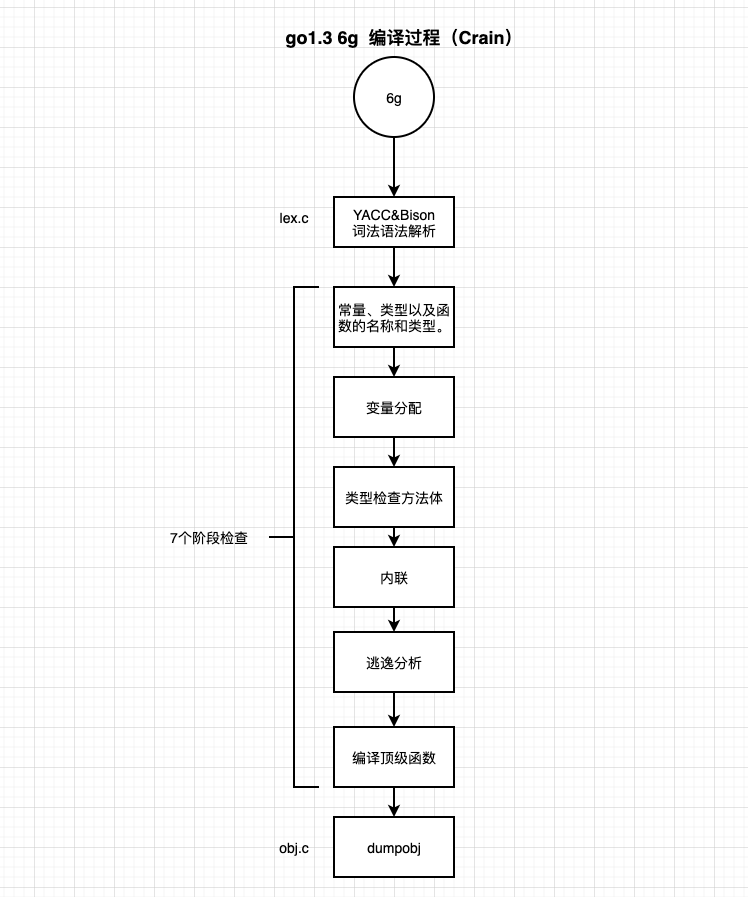

#【Golang源码分析】Golang如何实现自举 - 6g的编译过程（三）

&nbsp;&nbsp;很长的一段时间没有写文章了，因为忙着出版书籍，以及双减的影响有些懈怠。Golang自举这个系列还是接着之前的《【Golang源码分析】Golang如何实现自举 - dist介绍》一文中继续写，由于linux下go1.3编译*.c文件会调用gcc，编译go文件会调用“/mnt/pkg/tool/linux_amd64/6g”，所以本篇文章主要研究6g，以及go1.3源码编译过程。

# 1.6g简单回顾
&nbsp;&nbsp;在go1.3中其实一部分go的源代码还处于c源码实现，其中一部分是go实现，在这种情况下需要采用混合编译模式,通过dist进行编译。

**<center>图1-1 dist运行过程 </center>**
&nbsp;&nbsp;如图1-1所示，在运行dist编译时进行会有两个分支，一个是编译c文件会使用gcc进行编译，另外编译go会使用lib9库进行编译，也就是使用Plan 9,准确的是plan9port包。


# 2.Plan 9 与 Plan9port 由来
&nbsp;&nbsp;Plan 9 与 Plan9port 由来参考: http://t.zoukankan.com/ghj1976-p-5260463.html
## 2.1 Plan 9
&nbsp;&nbsp;Plan9其实是一个操作系统，由贝尔实验室开发，其主要的负责人是Rob Pike。

&nbsp;&nbsp;Plan 9不是一个很知名的作品，但是它的前身Unix是世人皆知的。而Plan 9是Unix的几位作者在AT&amp;T职业生涯的一件巅峰之作，是被设计来超越Unix的。    

&nbsp;&nbsp;实际上，Plan 9在1992年第一次发布时，就同时实现了Google Docs、Dropbox、Github、Remote Desktop等目前很火爆的互联网产品的功能。     

&nbsp;&nbsp;Plan 9能做到这些，是因为它把所有内容都注册到一个称为9P的文件系统里。     


## 2.2 Plan9port
&nbsp;&nbsp;Plan9port的作者是Russ Cox, 也是Go的设计者之一Russ Cox是Go和Google Code Search的作者，并且是Rob Pike的徒弟。他多年坚持用一台老旧的Mac mini搞开发，并且甚为自豪。

&nbsp;&nbsp;Russ离开AT&amp;T加入Google之后忍不住怀念Plan 9，所以把Plan 9上的用户程序——包括Acme——移植到其他操作系统上，称为Plan 9 from User Space。

git 上这个源码在：https://github.com/9fans/plan9port


Plan 9 from User Space这个名字很有意思——Plan 9这个名字其实来自一部1959年美国科幻电影《Plan 9 from Outer Space》。

Plan 9 from User Space支持以下操作系统:
- Linux
- Mac OS X
- FreeBSD, NetBSD, OpenBSD 
- SunOS 

参考地址： https://9fans.github.io/plan9port/

# 3.6g如何如何实现编译
&nbsp;&nbsp;其实在编译go文件阶段6g命令的主要用途是编译go文件为链接库，然而还有6l命令用于链接为可执行文件。

**<center>图3-1 go1.3编译过程 </center>**
&nbsp;&nbsp;如图3-1所示，其实go命令去“go build”的时候是调用go_bootstrap命令，然而go_bootstrap命令其实是调用6g进行编译，调用6l去进行链接可执行文件。

## 3.1 编译示例
&nbsp;&nbsp;可以简单准备一名为demo.go的源代码,代码如下：
```go
package main

func main() {
    printf("1111")
}
```
&nbsp;&nbsp;文中是使用docker 运行go1.3相关源码的，有兴趣可以看一下《【Golang源码分析】Golang如何实现自举（一）》一文，docker run的时候其实是没有go对应的环境变量，所以需要准备环境变量，对应的环境变量如下：

```bash
export PATH=/mnt/bin:$PATH
export GOROOT=/mnt
export GOPATH=/mnt/gopath
```

从图3-1得知go build其实是调用go_bootstrap命令，那么可以执行使用go_bootstrap命令进行编译查看，go_bootstrap增加 -v参数可以打印对应的包，-x参数可以查看整个执行过程(注：如果需要看其他的可以-h查看下帮助文档) 。命令如下：
```bash
#/mnt/pkg/tool/linux_amd64/go_bootstrap build -v -x demo.go
```


**<center>图3-2 go_bootstrap执行过程  </center>**

&nbsp;&nbsp;通过图3-2得知其实6g编译demo.go文件时会生成一个“command-line-arguments.a”的文件，6l会链接“command-line-arguments.a”文件并生成一个demo的可执行文件。


## 3.2 6g的编译过程
&nbsp;&nbsp;要知道6g都做了些什么事情，可以调试下6g。直接运行如下命令：
```bash
#gdb /mnt/pkg/tool/linux_amd64/6g
```
进入gdb模式后，可以输入如下参数:
```bash
(gdb) set args build demo.go
```
设置完参数后可以直接“b main”下一个main断点，并输入"r"运行编译过程，则进入main函数后通过“s”进入p9main函数，如图3-3所示。


**<center>图3-3 p9main函数调试过程  </center>**
&nbsp;&nbsp;通过图3-3可以看到其实编译会进入lex.c文件，在该文件中其实会调用go.h与y.tab.h文件，该文件其实是通过Bison 2.3生成，用于词法解析,并且使用yacc包脚本进行语法解析。除此之外还会经历7次语法检查, 分别是：
- 1.常量、类型以及函数的名称和类型。
- 2.变量分配。
- 3.类型检查方法体。
- 4.内联。
- 5.逃逸分析。
- 6.编译顶级函数。
- 7.检查外部声明。

&nbsp;&nbsp;最终检查完成后，调用dumpobj函数备份.a文件。整个过程如图3-4所示。

**<center>图3-4 6g编译过程  </center>**


# 总结
&nbsp;&nbsp;总的来说在go自举过程还是相对来说比较复杂的，会存在混编情况。编译c时通过gcc、编译go时通过6g生成对应的链接库，然后通过6l进行链接。其实还有很多细节需要探索,比如语言的runtime环境,还有liblink库inferno-os的应用等等。有时间我还是会继续更新该系列文章，做更深入的探索。

- 6g是用于编译.a链接库文件。
- 6l是用于链接.a文件，并生成可执行文件。
- 6g中包含Bison做词法解析，以及利用yacc做语法解析。
- plan9port是一个可移植性操作系统。
- go_bootstrap对应 "-v","-x"命令可以查看到对应的编译链接过程。

