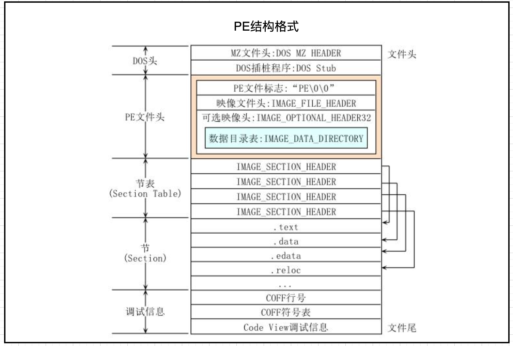
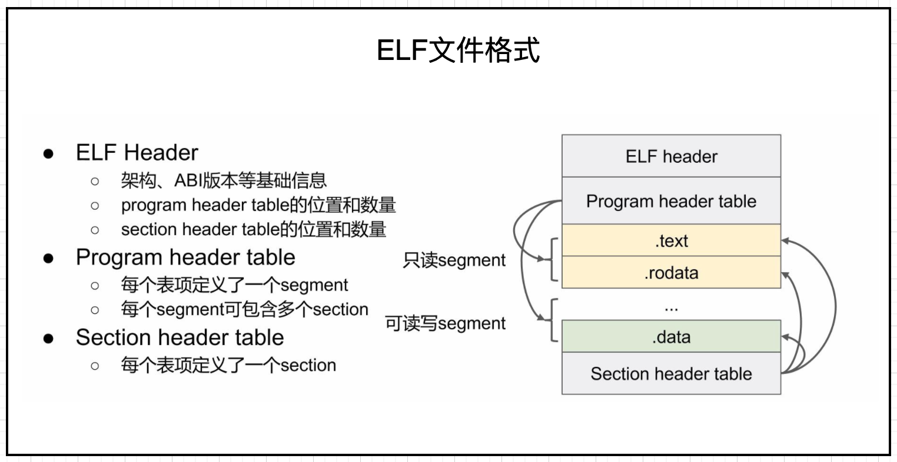
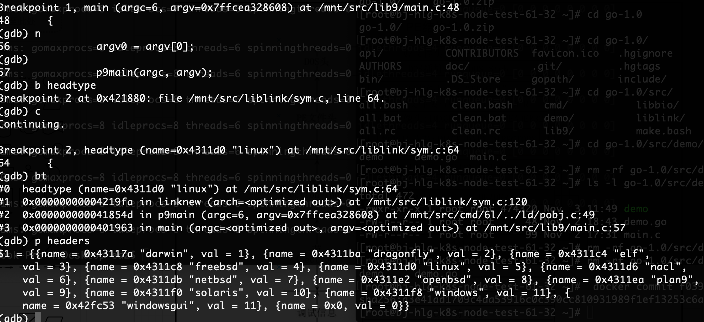
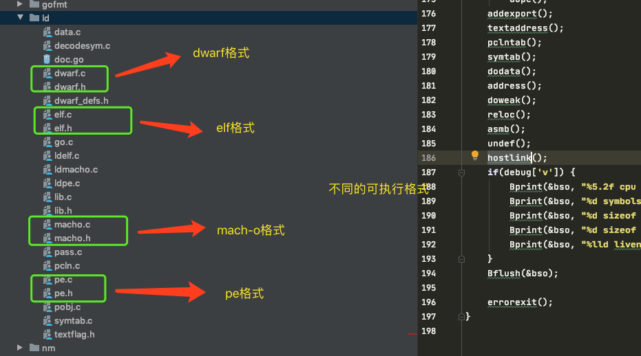

#【Golang源码分析】Golang如何实现自举 - 6l的链接过程（四）

&nbsp;&nbsp;接到催更的信息，其实还是很高兴。本来忙了很长一段时间为生活奔波，想给自己一个假期。后来脑子里响起了莎士比亚的一句话“如果一年到头如假日，岂不像连日工作那样疲乏？”，然后还是决定放下安逸的生活，继续去探索。

&nbsp;&nbsp;经过最近一段时间的忙碌，对生活也多了一些重新的认识。人活着不要盲目，不要止步不前，不要高估自己的实力，也不要低估自己的能力，多一些自我审视，反复review或许在生活上、工作上走的会更远～

&nbsp;&nbsp;一顿感概之后还是要回归主题，上一篇文章说到了go1.3编译使用了6g进行编译，编译成对应.a链接库。那么这一章接着来讲6l，那么继续来讲一下6l的实现过程与原理。

# 1.可执行文件介绍
&nbsp;&nbsp;在链接的过程中就是为了生成可执行文件，那么可执行文件肯定需要固定的格式。在计算机科学中，不同系统的二进制文件，可执行文件，目标代码、共享库等格式是不同的。
&nbsp;&nbsp;那么简单来介绍集中可执行文件的格式。

## 1.1 PE文件格式

&nbsp;&nbsp;PE文件格式主要应用与Windows系列系统，可执行文件索引。说到pe格式有一个比较知名的黑客社区(看雪)，就叫pediy。

&nbsp;&nbsp;PE（Portable Executable）格式，是微软Win32环境可移植可执行文件(如exe、dll、vxd、sys和vdm等)的标准文件格式。PE格式衍生于早期建立在VAX(R)VMS(R)上的COFF(Common Object File Format)文件格式。PE结构如图1-1所示。


**<center>图1-1 PE格式 </center>**

## 1.2 ELF文件格式

&nbsp;&nbsp;ELF文件格式是linux系列系统，可执行文件索引；ELF格式如图1-2所示。

&nbsp;&nbsp;ELF是UNIX系统实验室（USL）作为应用程序二进制接口（Application Binary Interface，ABI）而开发和发布的，也是Linux的主要可执行文件格式。
1999年，被86open项目选为x86架构上的类Unix操作系统的二进制文件标准格式，用来取代COFF。因其可扩展性与灵活性，也可应用在其它处理器、计算机系统架构的操作系统上。

**<center>图1-2 ELF格式 </center>**

## 1.3 mach-o文件格式
&nbsp;&nbsp;mach-o是mac系列系统的可执行文件格式，苹果系统是基于FreeBSD的，属于unix-like操作系统；

&nbsp;&nbsp;Mach-O曾经为大部分基于Mach核心的操作系统所使用。NeXTSTEP，Darwin和Mac OS X等系统使用这种格式作为其原生可执行文件，库和目标代码的格式。而同样使用GNU Mach作为其微内核的GNU Hurd系统则使用ELF而非Mach-O作为其标准的二进制文件格式。


## 1.4 小节提醒
 &nbsp;&nbsp; 其实文件格式在很多场景都会利用到，比如说经常听到的蠕虫病毒，还有外挂编程，还有软件查杀等等都会利用到。简单说，就拿PE结构来说，比如通过PE知道程序入口点，其实入口点一般都是代码段。那么在入口点动态注入代码，这样注入的代码段能做到复制，这就是一个蠕虫病毒的原理。
 
 &nbsp;&nbsp; 当然除了这些以外什么对程序加壳，加密，加花都会涉及到文件格式。
 
 &nbsp;&nbsp; 这边有一篇介绍文件结构比较好的文章： 
 https://blog.csdn.net/abc_12366/article/details/88205670 


# 2.Inferno介绍
&nbsp;&nbsp;6l除了使用plan9之外还使用了Inferno系统库。

&nbsp;&nbsp;Inferno 是一个分布式操作系统，最初由贝尔实验室开发，但现在由 Vita Nuova 作为自由软件开发和维护。使用 Inferno 的并发编程语言 Limbo 编写的应用程序被编译为其可移植虚拟机代码 (Dis)，以便在 Inferno 提供的可移植环境中的网络上的任何位置运行。不同寻常的是，该环境的外观和行为就像一个完整的操作系统。

&nbsp;&nbsp;Inferno 以类似文件的名称层次结构表示服务和资源。程序仅使用文件操作打开、读/写和关闭来访问它们。“文件”不仅仅是存储的数据，还代表设备、网络和协议接口、动态数据源和服务。该方法统一并为所有系统资源提供基本的命名、结构和访问控制机制。单一的文件服务协议（与 Plan 9 的 9P 相同）使所有这些资源都可以通过网络以统一的方式导入或导出，与位置无关。应用程序只是将它需要的资源附加到它自己的每个进程名称层次结构（“命名空间”）。

&nbsp;&nbsp;Inferno 可以在各种 ARM、PowerPC、SPARC 和 x86 平台上“本机”运行，也可以在现有操作系统（包括 AIX、FreeBSD、IRIX、Linux、MacOS X、Plan 9 和 Solaris）下“托管”，再次在各种平台上运行处理器类型。

&nbsp;&nbsp;这个 Bitbucket 项目包括基本应用程序的源代码、Inferno 本身（托管和本机）、所有支持软件，包括本机编译器套件、基本可执行文件和支持文件。


Inferno源代码： https://bitbucket.org/inferno-os/inferno-os/

Inferno文档： http://www.vitanuova.com/inferno/


# 3.6l执行过程
&nbsp;&nbsp;6l相对于6g来说会简单一些，6l其实就是针对不同的系统生成不同的执行文件结构，并且对文件结构填充数据。

## 3.1 调试内容
&nbsp;&nbsp;想要了解6l的一些过程可以通过如下命令：
```bash
#/mnt/pkg/tool/linux_amd64/6g -o ./command-line-arguments.a   -D _/mnt/src/demo  -pack ./demo.go

#/mnt/pkg/tool/linux_amd64/6l -v -o demo -extld=gcc ./command-line-arguments.a
```
&nbsp;&nbsp; 如上命令其实做了两件事情，一个是通过6g生成.a库，另外一个是通过6l链接6g生成的库。

&nbsp;&nbsp;既然知道6l命令用途，那么下断点的话，肯定要对6l进行调试，命令如下：
```bash
#gdb /mnt/pkg/tool/linux_amd64/6l
```

&nbsp;&nbsp;进入gdb模式后，需要设置编译参数，参数如下：
```bash
(gdb) set args -v -o demo -extld=gcc ./command-line-arguments.a
```
&nbsp;&nbsp;设置完参数后,就可以“b mian”下断点了，比较简单，就不赘述了。

## 3.2 过程介绍
&nbsp;&nbsp;经过对源码的阅读后,整理了一张流程图，如图3-1所示。

**<center>图3-1 6l链接过程 </center>**
&nbsp;&nbsp;根据上图可以得知plan9作为一个操作系统库，可以执行不同程序的main函数。除此之外在链接过程中会做一些操作，比如创建输出文件。根据不同的系统通过headtype函数获得不同的文件格式类型，如图3-2所示。

**<center>图3-2 不同系统的文件格式 </center>**
&nbsp;&nbsp;通过文件格式类型调用archinit生成不同的可执行结构,不同的结构对应一套代码，对应的dwarf结构、elf结构、mach-o结构、pe结构，如图3-3所示。

**<center>图3-3 不同系统的文件格式 </center>**
&nbsp;&nbsp;然后会调用各种函数对可执行结构进行数据段，代码段，系统描述符表，链接库等做数据填充，最后刷新到输出文件。

# 总结 
&nbsp;&nbsp;
&nbsp;&nbsp;了解6l之后对跨平台和可移植性系统有了一些认识，并且掌握了如下知识：
- 不同系统之间存在不同的可执行文件结构。
- 6l除了使用plan9之外还使用了Inferno系统库。
- plan9作为一个操作系统库，可以执行不同程序的main函数。
- headtype函数与archinit函数组合使用，针对不同的系统，初始化不同的结构体。
- 链接过程其实是通过可执行文件结构体填充不同程序段的数据。


&nbsp;&nbsp;其实针对填充的数据里还有很多更细节的，比如导出表，导入表等等。如果有兴趣可以自行研究，除此之外还有可执行程序的执行原理，比如unix/linux的execvp、windows的CreateProcessW等内核态调用细节。
